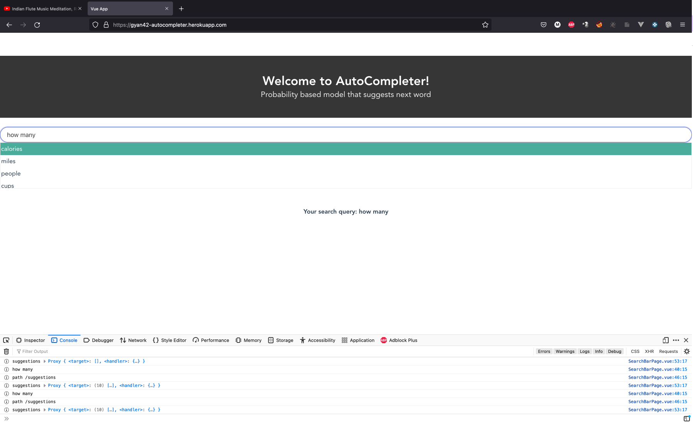

# autocomplete-ngram-model
NLP Autocomplete N-Gram Model

[http://gyan42-autocompleter.herokuapp.com](http://gyan42-autocompleter.herokuapp.com)



## UI

```
cd ui
yarn install

export NODE_ENV=developement
yarn serve --mode $NODE_ENV
```

## API

```
cd ui/
uvicorn main:app --host 0.0.0.0 --port 8088 --reload
```

## Web Links

- [API](http://0.0.0.0:8088)
- [Docs](http://0.0.0.0:8088/docs)
- [UI](http://localhost:8080/)

## Colab Notebook

https://colab.research.google.com/gist/Mageswaran1989/3e19b339477cc7acee67e9f1667978bf/autocorrectmodel.ipynb

## Docker

- https://apple.stackexchange.com/questions/373888/how-do-i-start-the-docker-daemon-on-macos

```
# Mac terminal setup
docker-machine create --driver virtualbox default
docker-machine restart
eval "$(docker-machine env default)"
```
On Mac run ` docker-machine ip` to get docker IP `192.168.99.100`

```
export DOCKER_BUILDKIT=1

# Build
docker build -t autocompleter-ui:latest -f ops/ui/Dockerfile .
docker build -t autocompleter-ui-linux:latest -f ops/ui/DockerfileLinux .
docker build -t autocompleter-api:latest -f ops/api/Dockerfile .

# Run
docker container run -p 8080:80 -it autocompleter-ui-linux
docker container run -p 8080:80 -it autocompleter-ui
docker container run -p 8088:8088 -it autocompleter-api 

# Dockerhub, personal references, not to be followed or follow with changes
docker tag autocompleter-ui:latest mageswaran1989/autocompleter-ui:latest
docker tag autocompleter-ui-linux:latest mageswaran1989/autocompleter-ui-linux:latest
docker tag autocompleter-api:latest mageswaran1989/autocompleter-api:latest

docker push mageswaran1989/autocompleter-ui:latest
docker push mageswaran1989/autocompleter-ui-linux:latest
docker push mageswaran1989/autocompleter-api:latest
```

## Docker Compose

- Mac
```
docker-compose -f ops/docker-compose.yaml up
```

- Linux
```
docker-compose -f ops/docker-compose-linux.yaml up
```

Mac Links on Local machine:

- [API](http://192.168.99.100:8088)
- [Docs](http://192.168.99.100:8088/docs)
- [UI](http://192.168.99.100:8080/)

Linux Links on Local Machine: 
- [API](http://0.0.0.0:8088)
- [Docs](http://0.0.0.0:8088/docs)
- [UI](http://localhost:8080/)


## Heroku

[Reference](https://testdriven.io/blog/deploying-flask-to-heroku-with-docker-and-gitlab/)

https://dashboard.heroku.com/apps/gyan42-autocompleter/activity

**Build Image**

```
docker build -t autocompleter-heroku:latest -f ops/heroku/Dockerfile .

#with shell access
docker run -e PORT=8765 -p 8080:8765 -p 8088:8088 -it autocompleter-heroku:latest bin/sh

docker container rm fastapi-vue --force
docker run -d --name fastapi-vue -e PORT=8765 -p 8080:8765 -p 8088:8088 autocompleter-heroku:latest

docker exec fastapi-vue cat ../etc/nginx/conf.d/default.conf

```

**Push to Heroku Registry**

```
heroku login
heroku container:login

# Build the image
docker build -t autocompleter-heroku:latest -f ops/heroku/Dockerfile .
# Tag it for Heroku registry
docker tag autocompleter-heroku:latest registry.heroku.com/gyan42-autocompleter/web
# Push it to Heroku registry
docker push registry.heroku.com/gyan42-autocompleter/web
# Release the app for public
heroku container:release --app gyan42-autocompleter web
# Check for logs
heroku logs --app gyan42-autocompleter
```

[http://gyan42-autocompleter.herokuapp.com](http://gyan42-autocompleter.herokuapp.com)